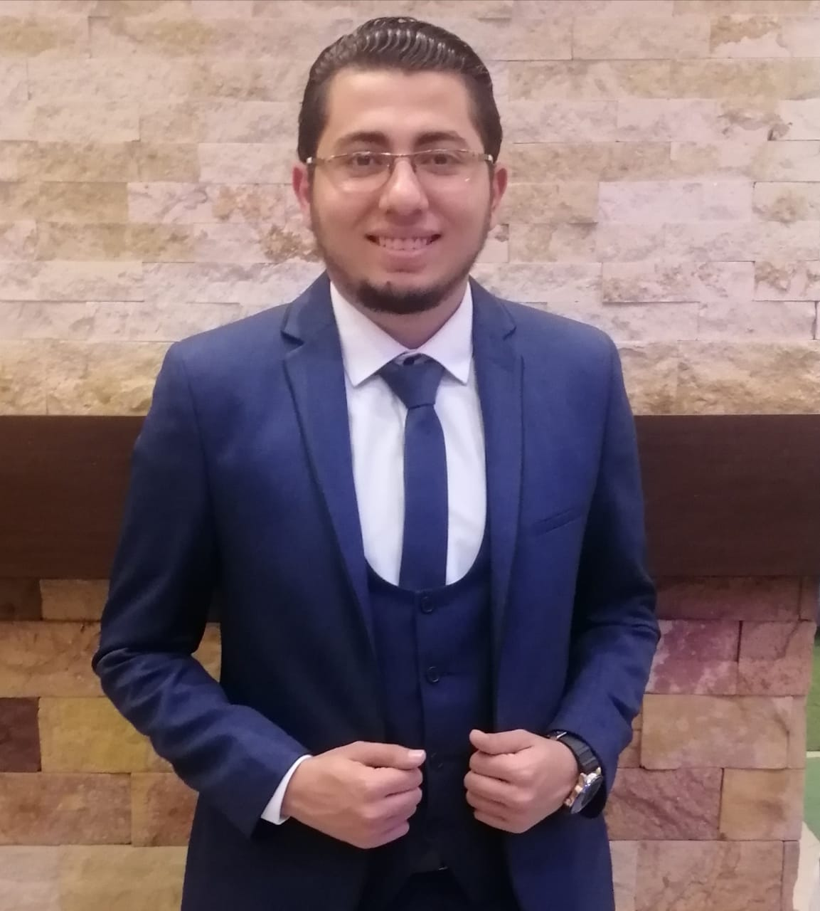

## Welcome To My Website

## Bio

**Name** : Omar Abdelzaher Ahmed

**Age** : 23

**University** : Cairo University

**Faculty** : Engineering

**Department** : Systems and Biomedical Engineering

**Academic year** : 4rd year

**E-mail** : omarzaher787@gmail.com

**GPA** : 3.48

If you want to take a look on my Curriculum Vitae just click on : [CV](https://drive.google.com/file/d/1rHSWd_nqtvr4Tj1tDyfbJbJLDt5GWpbn/view?usp=sharing)

## About :
I am studying systems and biomedical engineering at the faculty of engineering, Cairo University. I had been volunteering in student activities like BEAT for three years and became the president in the last year. I had earned many skills like Negotiation skills, Teamwork, Leadership, Problem-solving, Decision making, handling hard situations, time management and working under pressure. I had been a chemistry assistant for the third secondary and still.

## Skills :
- Technical Skills:

	- HTML
	-	CSS
	- Git
	- Python
	- C++
	- R Language
	- Latex
	- Matlab    

- Soft Skills:

    - Communication Skills
    - Presentation Skills
    - Negotiation Skills
    - Research Skills
    - Time Management
    - Problem Solving

## Blogs :
[Project in R : Haberman's Survival with Machine Learning](https://omarabdelzaher.github.io/Machine-Learning-Blog/)

## Projects & Acheivements :
* Medical Equipment Field:
  * Microbiology unit
  * Baby Incubator
  * Prosthetic limb
  * Fluid level detector

* Database Field:
  * Huffman compression and decompression
  * CMMS system for hospitals
    * Repository: https://github.com/remonalbear/CMMS

* DSP Field:
  * Signal Viewer with 5 channels
  * Equalizer
  * Image Mixer
  * Shazam like application (Sound Recognition)
  * Sound separator (Cocktail party problem)
  * Virtual Instruments (Piano – Guitar) Note: All in **Python** programming language

* Graphics Field:
  * A Robot that can move, sit down, stand up, hold things in a scene. The scene consists of a floor (Texture Mapped) that we can change through a menu.
  * The scene includes objects and can be viewed from different angles as we can control the camera movement.
    * Note: Using **OpenGL**  
	 * Repository: https://github.com/SaraAdel540/Graphics-Final_Project

* Electronics Field:
  * Traffic Light using **Assembly** language
    * Repository: https://github.com/remonalbear/Trassic_Light_Assembley_8051
  * Elevator using **C** language
    * Repository: https://github.com/remonalbear/Elavotor_8051
  * Digital Filter using **C** language

* A Mathematical Model for robot indenter
Submitted to Dr. Ahmed G. Radwan / Cairo University
  * Info: A Scientific report about a mathematical model for robot indenter in the surgical field.

# To get in touch :

          
